# Logigrammes Orderlift - version demarrage 0-6 mois

Source analysee: `import-lists/Organisation et Logigramme _version démarrage.docx`.

Cette version reprend la logique du document de demarrage: equipe reduite, DG implique, peu de validations, execution rapide, et separation claire des roles operationnels.

## Roles de demarrage

- Direction Generale.
- Responsable Vente Distribution.
- Responsable Vente Installation.
- Responsable Achat.
- Responsable Stock.
- Responsable Projet installation et maintenance.
- Responsable Admin, pricing et importation.
- Responsable Logistique.
- BET interne ou externe.
- AC1: agent commercial partenaire autonome, generalement externe et commissionne.
- AC2: agent commercial coordination et suivi, lien entre clients/partenaires non qualifies digitalement et le systeme.
- AC3: agent commercial point de vente, rattache a un showroom ou depot.

## Carte des processus

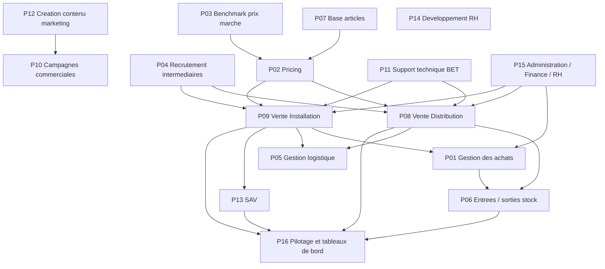

## P01 - Gestion des achats

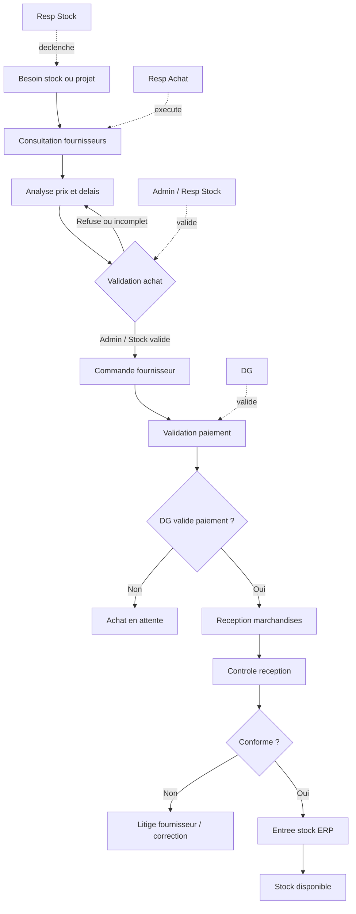

## P02 - Pricing

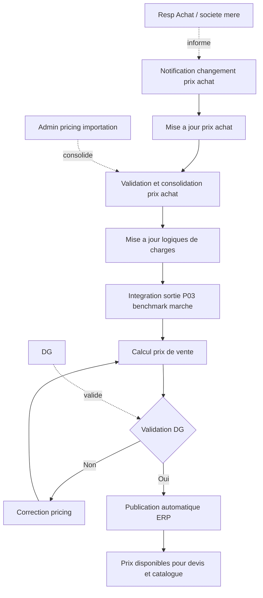

## P03 - Benchmark prix marche

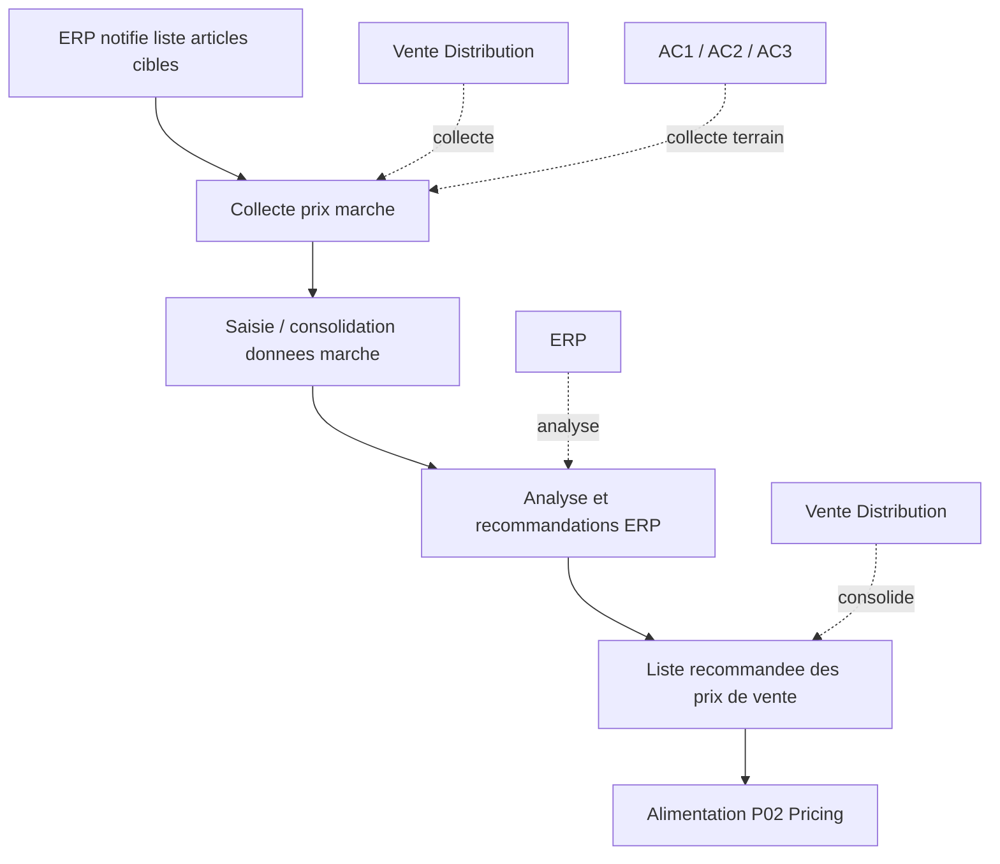

## P04 - Recrutement intermediaires

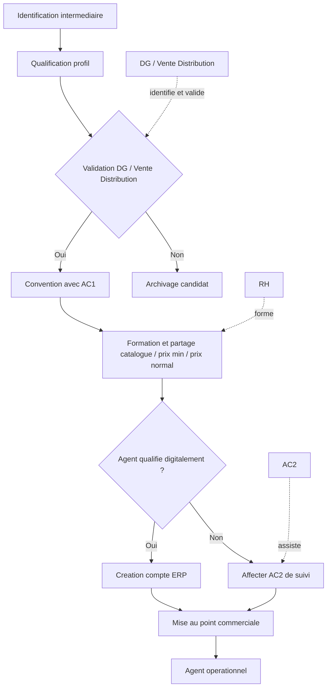

## P05 - Gestion logistique

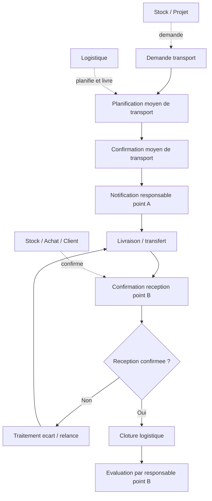

## P06 - Entrees / sorties stock

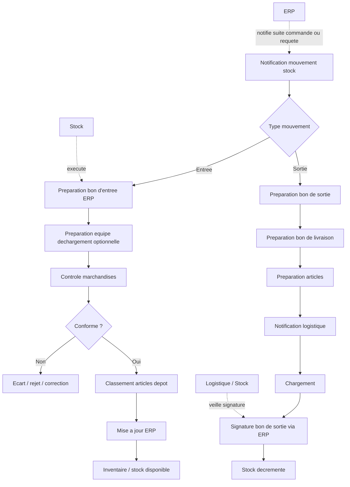

## P07 - Base articles

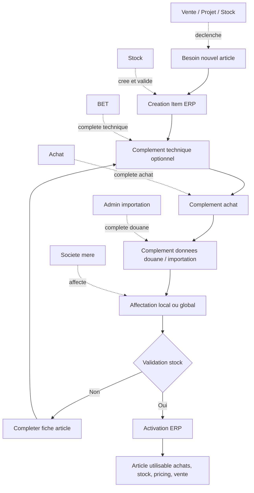

## P08 - Vente Distribution

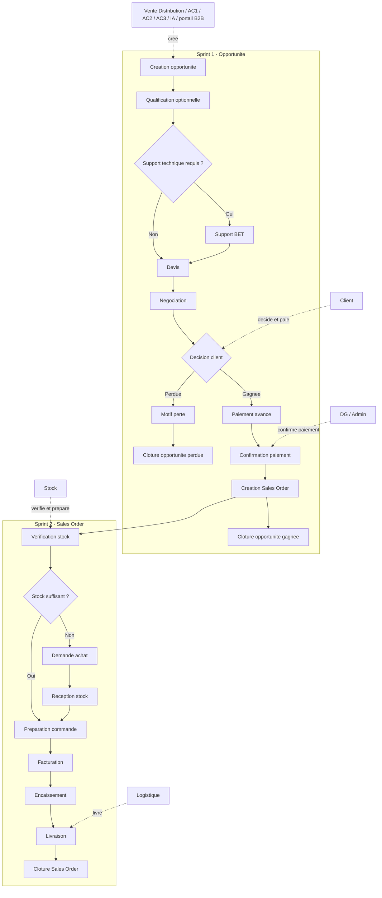

## P09 - Vente Installation

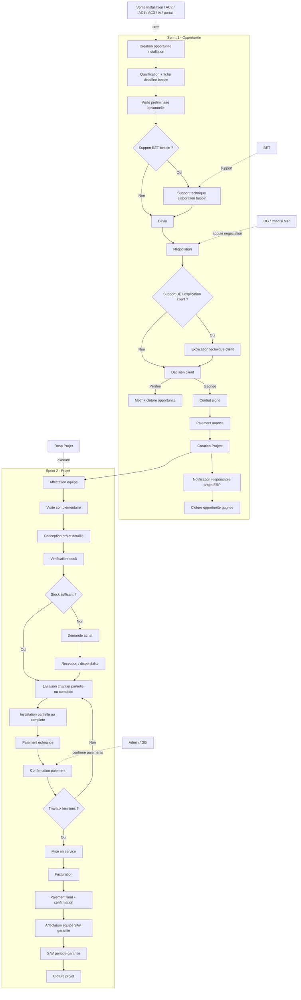

## P10 - Campagnes commerciales

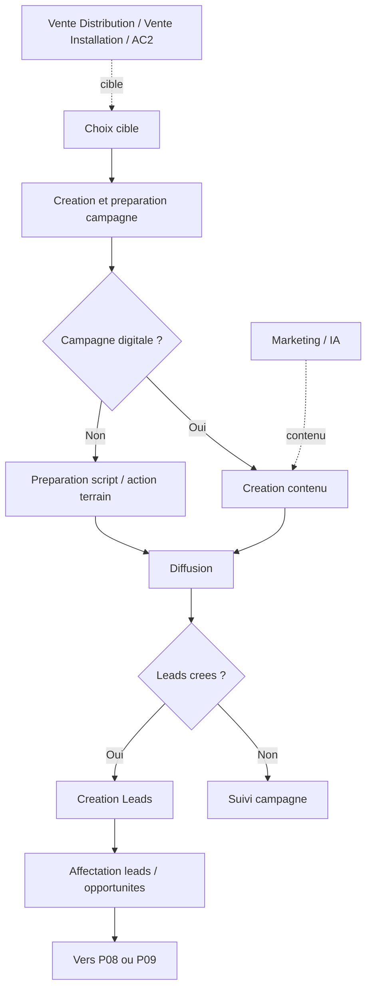

## P11 - Support technique BET

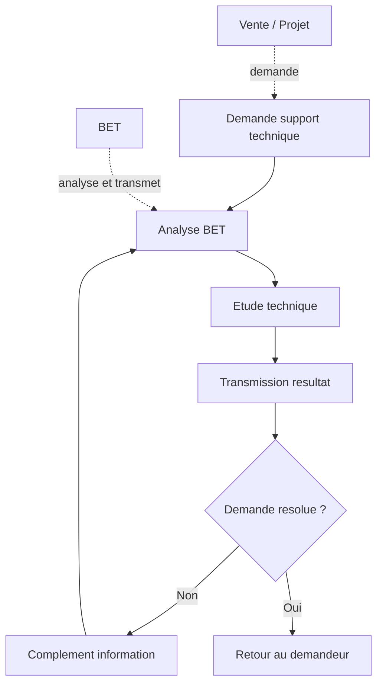

## P12 - Creation contenu marketing

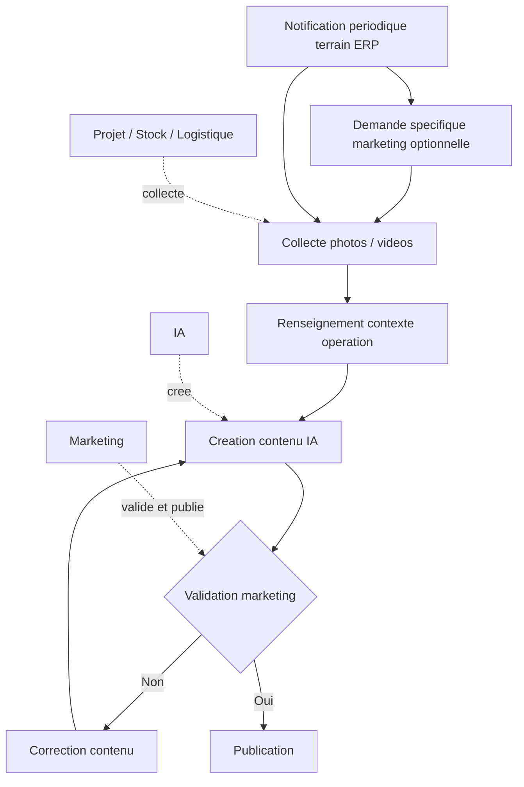

## P13 - SAV

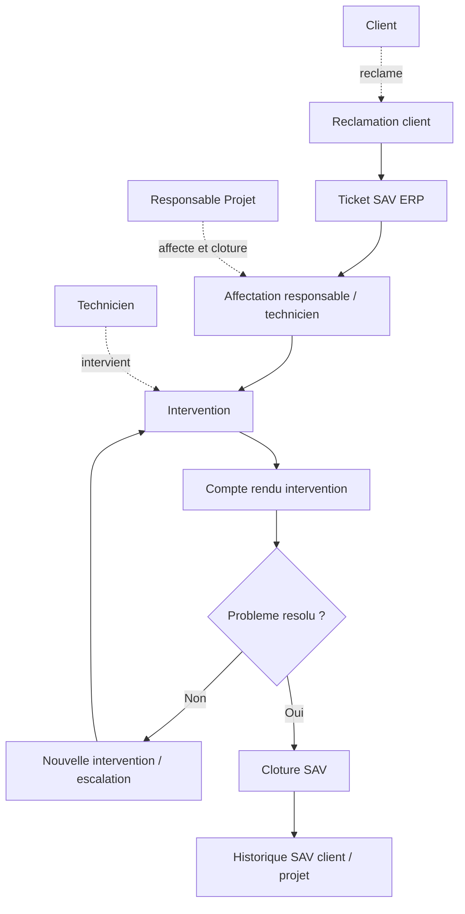

## P14 - Developpement RH

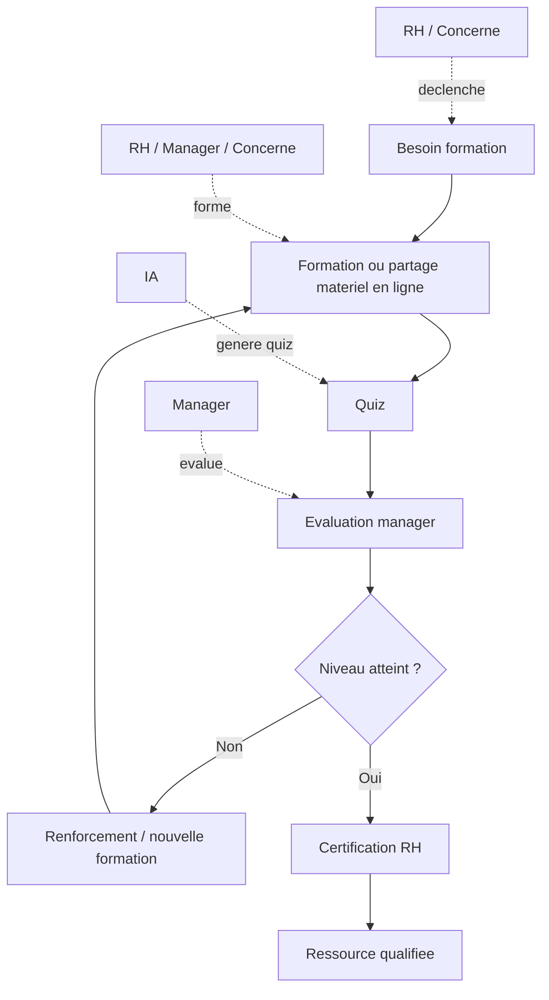

## P15 - Administration / Finance / RH

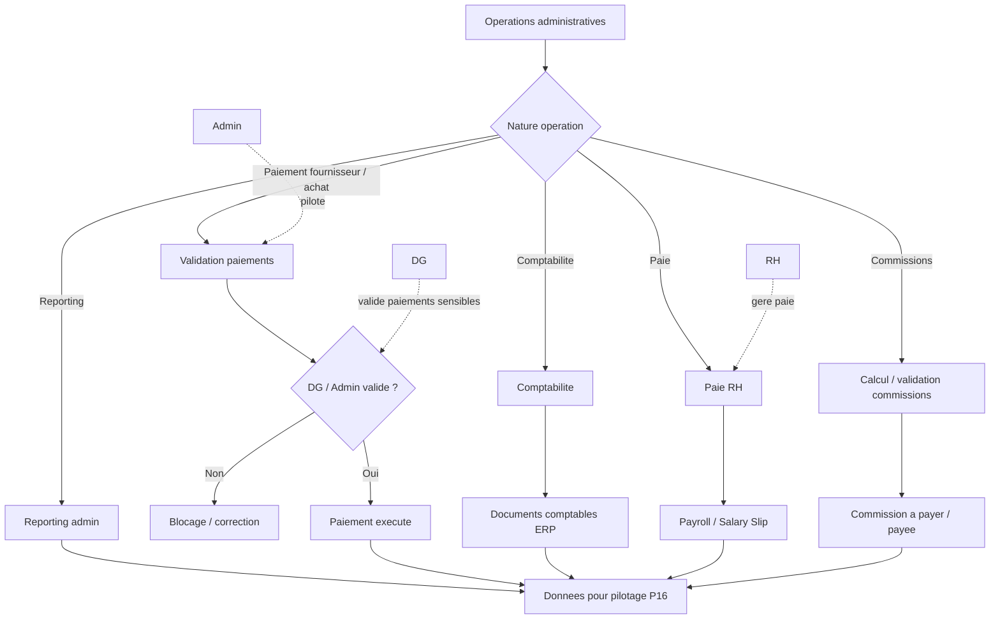

## P16 - Pilotage et tableaux de bord

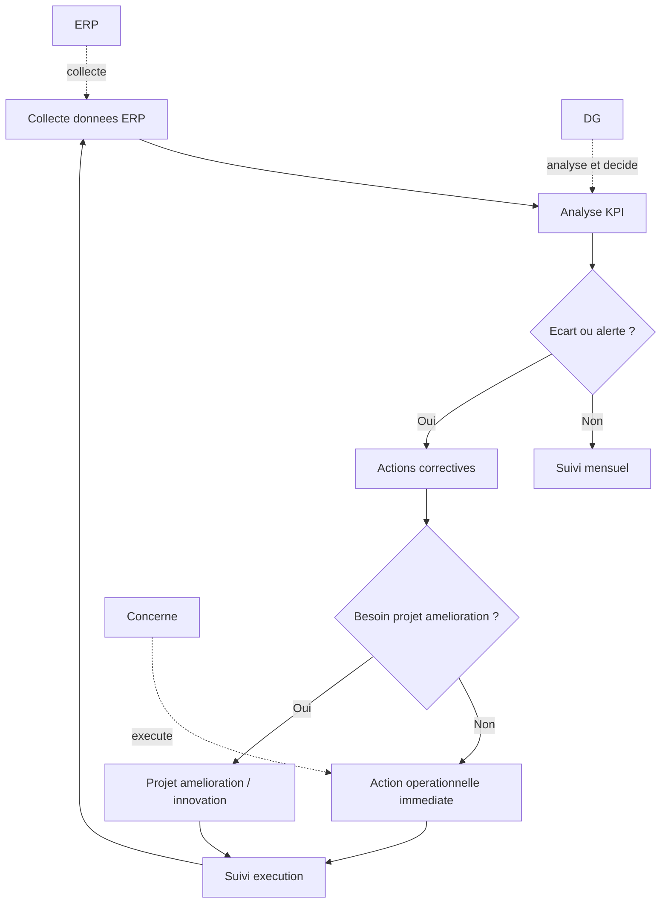

## Ecarts importants avec la version V1 precedente

- Le fichier de demarrage contient 16 processus, pas 15.
- `Benchmark prix marche` est separe du `Pricing` en P03.
- `Administration / Finance / RH` et `Pilotage` sont deja inclus dans la version demarrage.
- Les procedures sont volontairement plus courtes: peu de validations, DG implique, execution rapide.
- Les flux Vente Distribution et Vente Installation sont decoupes en deux sprints: opportunite puis execution commande/projet.
- Les agents AC1, AC2 et AC3 sont centraux dans les ventes, campagnes et recrutement intermediaires.
