# Logigrammes prioritaires Orderlift - V1

Ces logigrammes Mermaid couvrent les procedures 1 a 15 en s'appuyant sur le fonctionnement actuel de l'application Orderlift: modules natifs ERPNext, pages Orderlift, hooks serveur, pipelines CRM/logistique, pricing, SAV, SIG, training, finance et droits par societe.

## Conventions

- Les documents natifs ERPNext sont notes tels quels: `Sales Order`, `Purchase Order`, `Delivery Note`, etc.
- Les objets/pages Orderlift sont notes tels quels: `Pricing Sheet`, `Forecast Load Plan`, `SAV Ticket`, `Campaign Manager`, etc.
- Les noeuds `Guardrail` representent des validations bloqueantes ou alertes systeme.
- Les noeuds `Dashboard` representent les vues de pilotage utilisees par l'equipe.

## 1. Gestion de l'operation d'achats

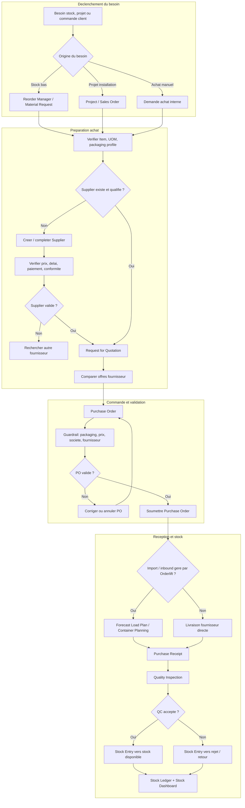

## 2. Pricing - definition et actualisation des prix de vente

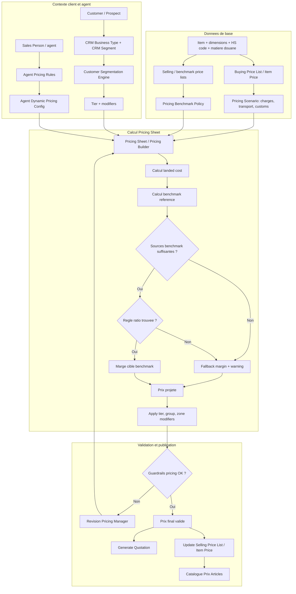

## 3. Recrutement d'un intermediaire / apporteur d'affaires

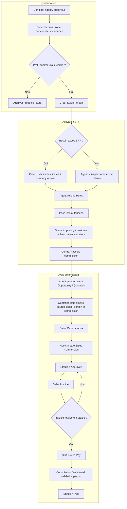

## 4. Gestion de l'operation logistique

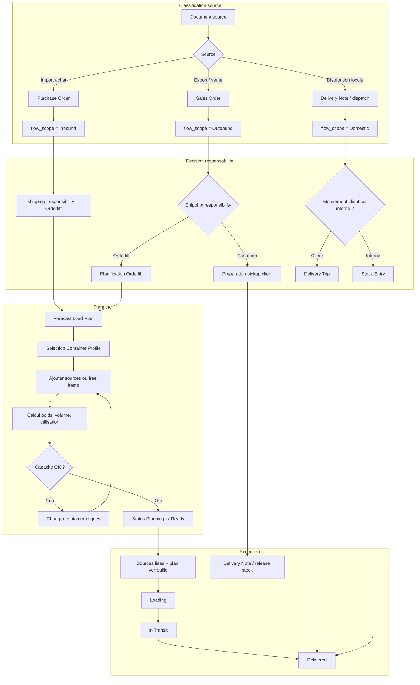

## 5. Gestion des entrees / sorties du stock

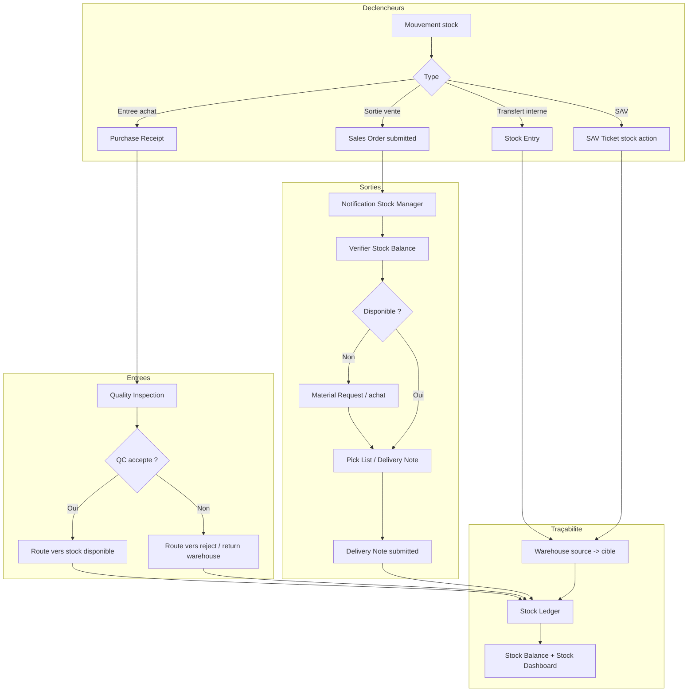

## 6. Actualisation de la database articles

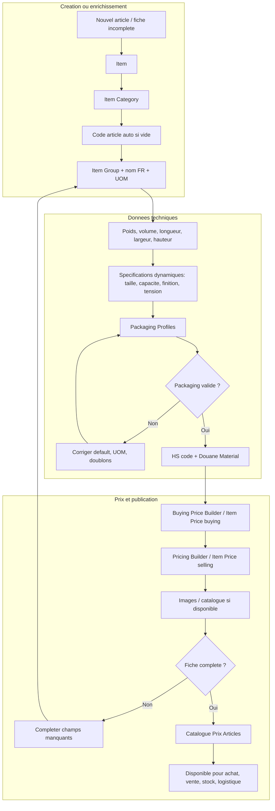

## 7. Creation de contenu marketing terrain

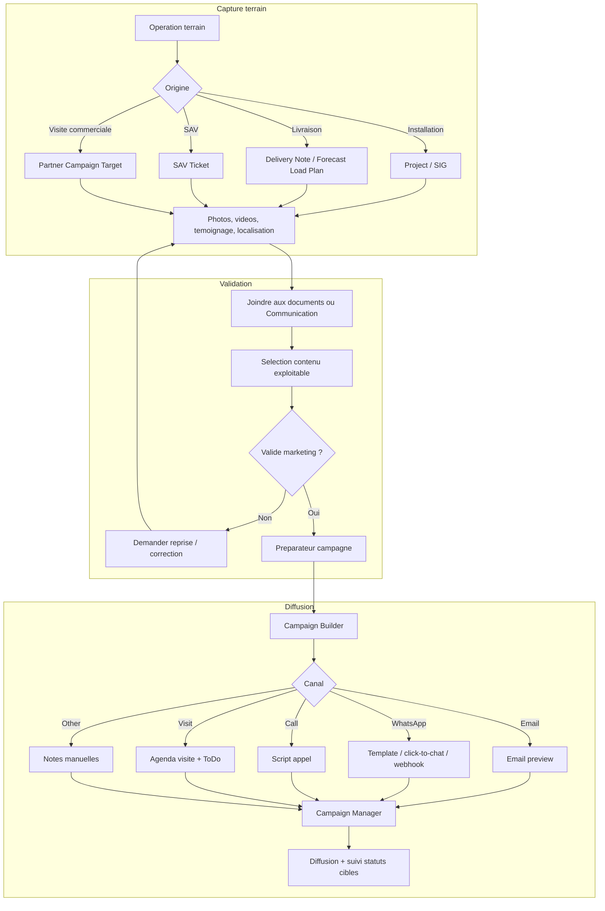

## 8. Suivi de projet d'installation d'ascenseur

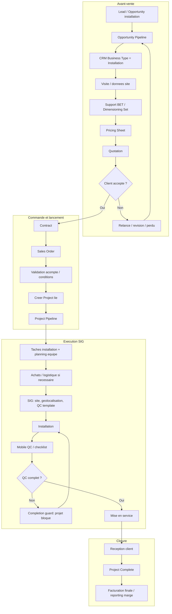

## 9. Suivi des demandes SAV

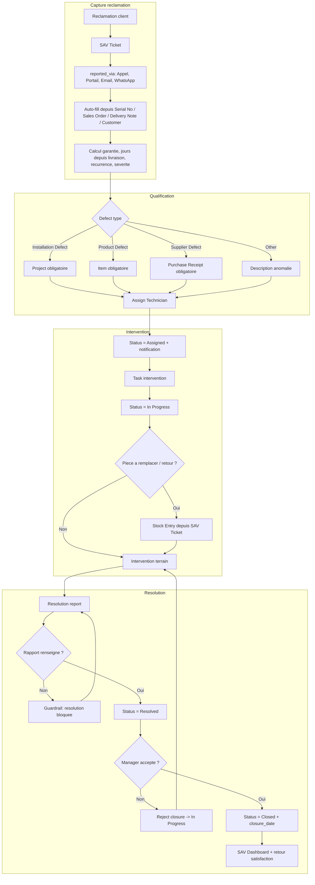

## 10. Montee en competence RH

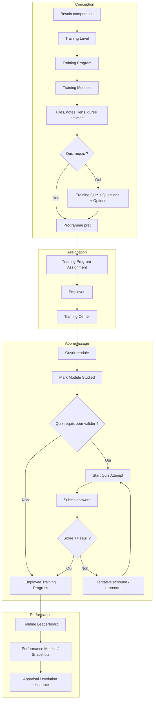

## 11. Demande de support technique BET

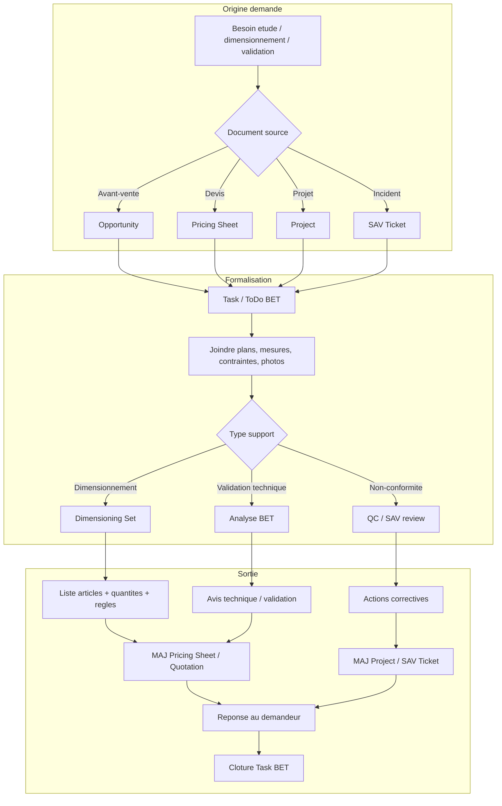

## 12. Operation de vente - Distribution B2B

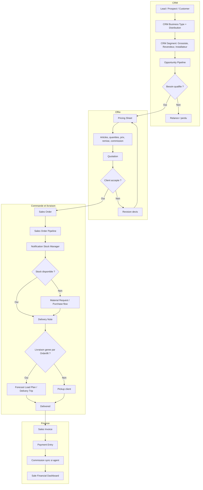

## 13. Operation de vente - Installation B2C / projets

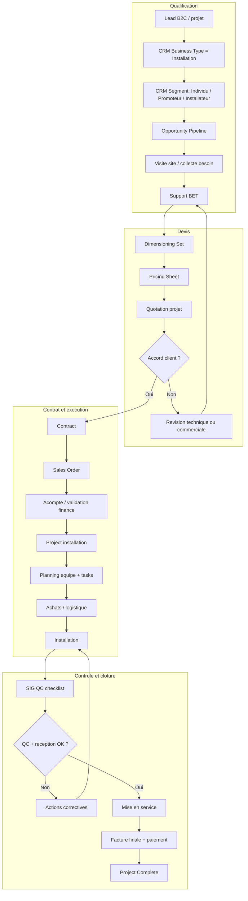

## 14. Innovation et amelioration continue

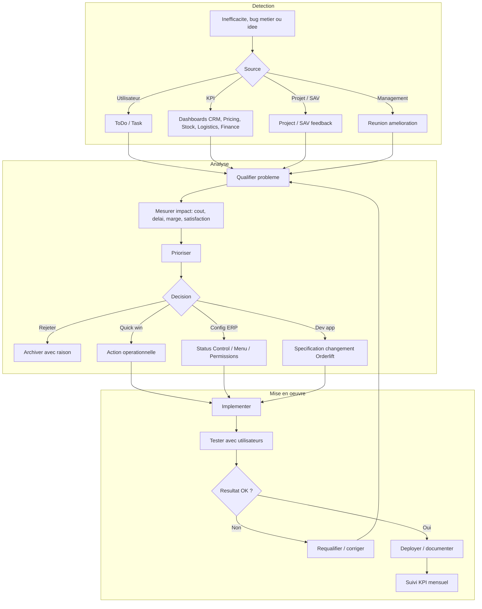

## 15. Lancement d'une nouvelle campagne commerciale

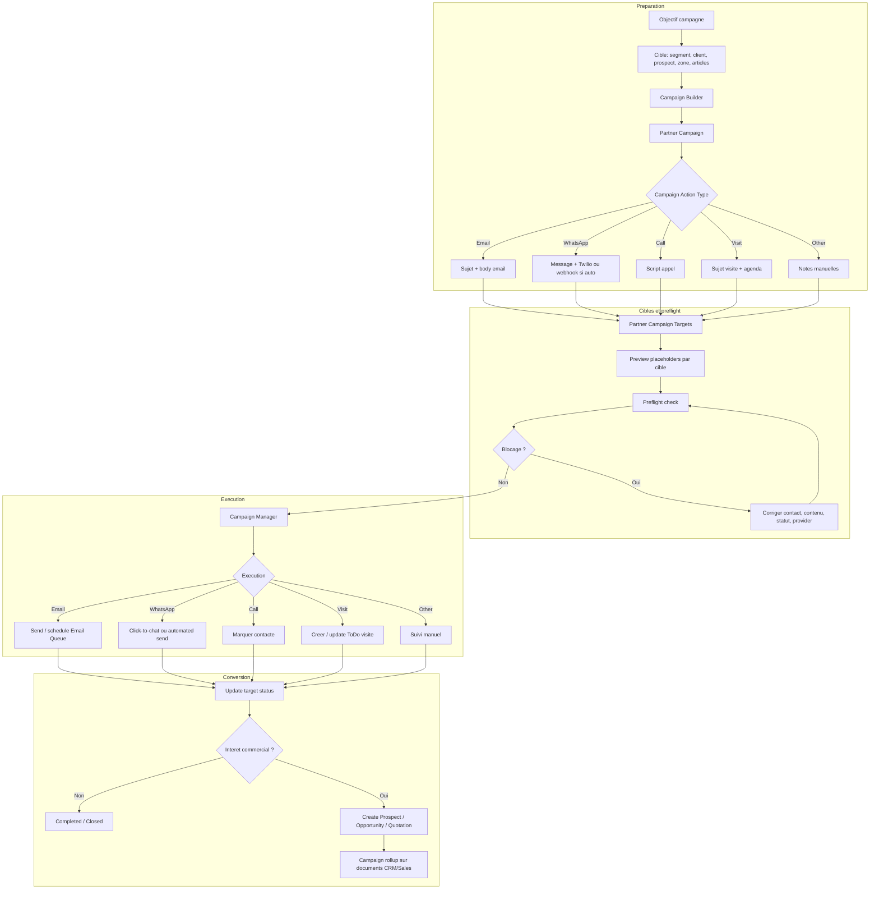

## V2 a produire ensuite

Les procedures 16 a 25 peuvent etre ajoutees dans un second document ou une section V2:

- Validation financiere des achats et engagements.
- Gestion des commissions commerciales.
- Gestion des reclamations client hors SAV technique.
- Cloture financiere d'un projet.
- Controle qualite installation / livraison.
- Benchmark marche structure.
- Creation / validation fournisseur.
- Gestion des sous-traitants installation / transport.
- Gestion des droits utilisateurs ERP.
- Reporting mensuel de performance.
