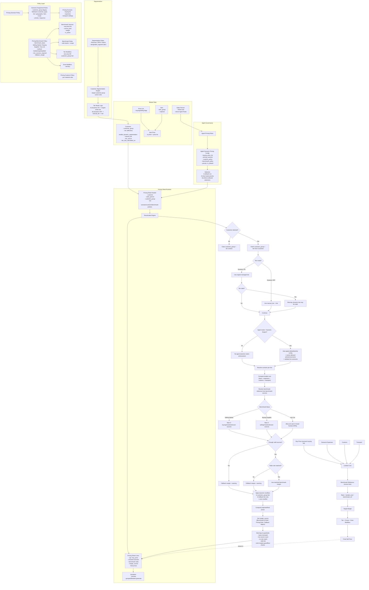

# Pricing Process Mapping

```mermaid
flowchart TD
  %% =========================
  %% 1) MASTER DATA
  %% =========================
  subgraph M["Master Data"]
    C["Customer
- customer_group
- tier (effective)
- enable_dynamic_segmentation
- manual_tier
- tier_source
- tier_last_calculated_on"]
    SP["Sales Person
- linked user
- drives Agent Rules"]
    I["Item
- item_group
- material"]
    PL["Price List
- buying/selling flags"]
    IP["Item Price
- by item + price list"]
  end

  PL --> IP
  I --> IP

  %% =========================
  %% 2) SEGMENTATION
  %% =========================
  subgraph SEG["Segmentation"]
    SE["Customer Segmentation Engine
- target customer group
- active rules"]
    SR["Segmentation Rules
- Revenue / RFM / Orders
- designated_segment (tier)"]
    TM["Tier Mode Logic
A) Dynamic ON -> engine writes tier
B) Dynamic OFF -> manual_tier -> tier"]
  end

  SR --> SE --> TM --> C

  %% =========================
  %% 3) AGENT GOVERNANCE
  %% =========================
  subgraph AG["Agent Governance"]
    APR["Agent Pricing Rules"]
    ADC["Agent Dynamic Pricing Config
- buying_price_list
- pricing_scenario
- customs_policy
- benchmark_policy
- priority / is_default"]
    ADSEL["Selection
1) default row
2) else lowest priority
3) enforce allowed selections"]
  end

  SP --> APR --> ADC --> ADSEL

  %% =========================
  %% 4) POLICY LAYER
  %% =========================
  subgraph POL["Policy Layer"]
    PSP["Pricing Scenario Policy"]
    PSR["Scenario Assignment Rules
- customer_group (legacy fieldname customer_type)
- tier / geography / item scope
- priority / sequence"]
    PSC["Pricing Scenario
- buying list
- expenses
- transport settings"]

    PCP["Pricing Customs Policy
- per material rules"]

    PBP["Pricing Benchmark Policy
- benchmark_basis:
  Selling Market / Buying Supplier / Any List
- method: median/avg/weighted
- min_sources_required
- fallback_margin"]
    PBS["Benchmark Sources
- any price list
- source_kind
- weight
- is_active"]
    PBR["Benchmark Rules
- ratio bands + scope"]
    PTM["Tier Modifiers
- tier-only OR customer_group+tier"]
    PZM["Zone Modifiers
- territory"]
  end

  PSP --> PSR --> PSC
  PBP --> PBS
  PBP --> PBR
  PBP --> PTM
  PBP --> PZM

  %% =========================
  %% 5) RUNTIME PIPELINE
  %% =========================
  subgraph RT["Pricing Sheet Runtime"]
    PSH["Pricing Sheet Header
- customer
- sales_person
- customer_group
- tier
- scenario/customs/benchmark policies"]
    LNS["Pricing Sheet Lines
- qty / buy_price
- resolved scenario
- benchmark stats
- margin_source
- final prices"]
    REC["Recalculate Engine"]
    Q["Quotation
- preview
- grouped/detailed generate"]
  end

  C --> PSH
  ADSEL --> PSH
  PSH --> REC --> LNS --> Q

  %% =========================
  %% 6) DECISION / CASE LOGIC
  %% =========================
  REC --> D1{"Customer selected?"}
  D1 -- No --> D1N["Clear customer_group + tier context"]
  D1 -- Yes --> D1Y["Fetch customer_group + tier from Customer"]

  D1Y --> D2{"Tier mode?"}
  D2 -- Dynamic ON --> D2A["Use engine-managed tier"]
  D2 -- Dynamic OFF --> D2B["Use manual_tier -> tier"]

  D2A --> D2S{"Tier stale?"}
  D2S -- Yes --> W1["Warning: dynamic tier may be stale"]
  D2S -- No --> D3["Continue"]
  D2B --> D3
  W1 --> D3

  D3 --> D4{"Agent mode = Dynamic Engine?"}
  D4 -- No --> D4N["No agent dynamic matrix enforcement"]
  D4 -- Yes --> D4Y["Auto-apply default/priority config
+ restrict allowed policies/scenarios
+ validate line scenarios"]

  D4N --> D5["Resolve scenario per line"]
  D4Y --> D5

  D5 --> D6["Compute landed cost
(base + expenses + customs + transport)"]

  D6 --> D7["Resolve benchmark reference from benchmark sources"]

  D7 --> D8{"Benchmark Basis"}
  D8 -- Selling Market --> B1["Warn if buying/mixed/unknown sources"]
  D8 -- Buying Supplier --> B2["Warn if selling/mixed/unknown sources"]
  D8 -- Any List --> B3["Allow all; warn if mixed buying+selling"]

  B1 --> D9{"Enough valid sources?"}
  B2 --> D9
  B3 --> D9

  D9 -- No --> F1["Fallback margin + warning"]
  D9 -- Yes --> D10{"Ratio rule matched?"}
  D10 -- No --> F2["Fallback margin + warning"]
  D10 -- Yes --> R1["Use matched benchmark margin"]

  F1 --> D11
  F2 --> D11
  R1 --> D11

  D11["Apply dynamic modifiers
1) customer_group+tier
2) fallback tier-only
+ zone modifier"] --> D12["Compute projected/final prices"]

  D12 --> D13["Set margin_source
(Benchmark & Rule / Pricing Rule / Fallback legacy)"]

  D13 --> W2["Warnings & guardrails
- basis mismatch
- low source count
- no rule match
- stale tier
- strict margin guard/floor checks"]

  W2 --> LNS

  %% =========================
  %% 7) WHAT DRIVES FINAL PRICE
  %% =========================
  BPR["Buy Price (scenario buying list)"] --> LC["Landed Cost"]
  EXP["Scenario Expenses"] --> LC
  CUS["Customs"] --> LC
  TRN["Transport"] --> LC
  LC --> REF["Benchmark Reference (source lists)"]
  REF --> RATIO["Ratio = landed_cost / benchmark_ref"]
  RATIO --> MRG["Target Margin"]
  MRG --> MOD["Tier + Group + Zone Modifiers"]
  MOD --> FINAL["Final Sell Price"]

  FINAL -. shown in .-> LNS
```
